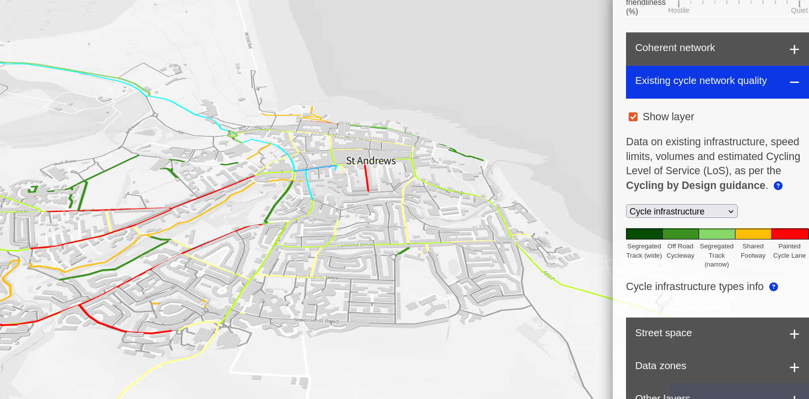

## Introduction

This is part of the [St Andrews Bell Edwards Geographic Data Institute (BEGIN) Seminar Series](https://begin.wp.st-andrews.ac.uk/category/seminars/), held in the Irvine Building, University of St Andrews, North Street, St Andrews, KY16 9AL, Scotland, and hosted by [Fernando Benitez](https://www.st-andrews.ac.uk/geography-sustainable-development/people/mfbp1/).

## Blurb

[Robin Lovelace](https://www.robinlovelace.net) is Professor of Transport Data Science at the Leeds Institute for Transport Studies ([ITS](https://environment.leeds.ac.uk/transport/staff/953/dr-robin-lovelace)).
Robin specializes in data science and geocomputation, with a focus on developing geographic methods applied to modeling transport systems, active travel, and decarbonisation.
Robin has experience not only researching but deploying transport models in inform sustainable policies and more effective use of transport investment, including as Lead Developer of the Propensity to Cycle Tool (see www.pct.bike), the basis of strategic cycle network plans nationwide.
Robin has led numerous data science projects for organizations ranging from the Department for Transport and Transport Infrastructure Ireland to the World Bank.

<!--  -->

Illustration of the Network Planning Tool (NPT) results for St Andrews

