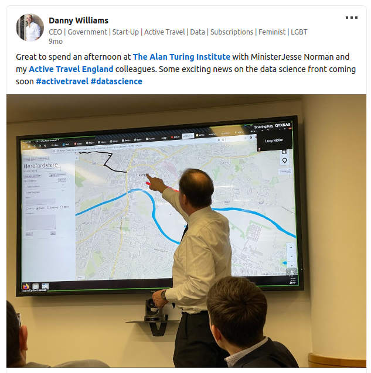

Like last year’s reflections post, I’m going to keep this one short and use it as a chance to reflect on what I’ve been up to over the last 12 months, what I’ve been working on, research I’ve contributed to, and hopes for next year.

# Research

It was a productive year for my research outputs, in which I was co-author on the following research outputs:

- [*Cycle network policy, planning and investment transformed by the Propensity to Cycle Tool*](https://www.robinlovelace.net/publication/lovelace-ref-2023/), not an academic paper but a case study about the pathways from research to impact, as part of the UK’s Research Excellence Framework (REF).
  The work was assessed as being a *4\** *REF Impact Case Study* according to the amazing team at the University of Leeds who supported me to condense 5+ years of work into a single report (Lovelace et al. 2023).

- [*A road segment prioritization approach for cycling infrastructure*](https://www.robinlovelace.net/publication/mahfouz-road-2023/), a paper led by my PhD student Hussein Mahfouz, that explores methods for prioritising investment in active travel networks that take into account equity and cost effectiveness (Mahfouz, Lovelace, and Arcaute 2023).
  It took a LONG and occasionally frustrating amount of time to get through the peer review process but I’m really happy that this is now published in a top journal (JTG).

- *Contraflows and cycling safety: Evidence from 22 years of data involving 508 one-way streets* is a paper led by my former PhD student Caroline Tait (Tait et al. 2023).
  It is, to the best of our knowledge, the most detailed data-driven assessment of the safety of contraflow cycling interventions which is highly policy relevant: it challenges the unfounded assumption that contraflow cycleways should not be approved on safety grounds, especially in places like London where there are existing cycling communities and high potential.

- *Where to invest in cycle parking: A portfolio management approach to spatial transport planning* was the result of an Master’s dissertation project at ITS, it’s a solid method for prioritising in cycle parking that I hope to see implemented soon (Ito, Morgan, and Lovelace 2023).

- *Road lighting and cycling: A review of the academic literature and policy guidelines* is the first review into the research on street lighting and cycling led by my colleague Eugeni (Vidal-Tortosa and Lovelace 2023).

- *Packaging code for reproducible research in the public sector* is not actually published yet, but I’m very proud of this collaboration between me, Federico Botta from the University of Exeter, Arthur Turrell of the Data Science Campus, and Laura Gilbert from the data science team in No. 10 (10DS) (Botta et al., n.d.)

# Second job

2023 was an exhilarating year work-wise, as I took on a new role as a civil servant, in addition to my main job as an associate professor in transport data science at the University of Leeds.
The new part time role is with Active Travel England, the government agency tasked with creating a step change in walking and cycling nationwide.
I had a broad remit but my main aim during the first part was to build the data and digital team, which I’m happy to say, job done.
We started 2023 with only 1 person with a data and digital remit (me) and end it with a small but effective team of 7.

There were many proud moments over the last 12 months in Active Travel England, one of the greatest being the launch of the collaboration between Active Travel England and the Alan Turing Institute, the UK’s national institute for data science and AI.
Building on my links with the ATI as a Turing Fellow, and my previous working with Dustin Carlino and others on the prototype [ActDev](https://actdev.cyipt.bike/) tool, we secured funding for a 2 year project for the ATI to develop the Active Travel Infrastructure Platform (ATIP).

From the [Active Travel England press release](https://www.gov.uk/government/news/alan-turing-institute-partnership-brings-data-expertise-to-nationwide-walking-and-cycling-schemes):

> This \[collaboration\] will enable the development of new functionality in the Active Travel Infrastructure Platform (ATIP), which helps councils to map out proposed schemes and see the impact they could have locally.

> These new tools will be paired with existing data sources such as OpenStreetMap, to create innovative solutions that will help build the evidence needed to meet national government’s objectives on active travel, including for 50% of short trips in urban areas to be made by walking, wheeling and cycling by 2030.
> The investment will demonstrate how new software engineering and data science techniques can support evidence-based planning and support Active Travel England’s mission.

I played a role in securing the funding, writing the grant funding agreement, submitting it (with lots of support from ATE colleagues) and getting people in the ATI and ATE onboard.
The most credit goes to Dustin and everyone involved, it’s still a work in progress, but the first version of the ATIP is now live and being used by local authorities across the country to plan walking and cycling schemes.

See the open source code underlying the functionality plus links to a live web app at [github.com/acteng/atip](https://github.com/acteng/atip).

Like the Propensity to Cycle Tool (which I got to demo to the then Secretary of State for transport in 2017), the ATIP project is highly conducive to collaborative planning and live demos.
<!-- As shown below, we got a chance to demo the tool to the government minister with the active travel brief, Jesse Norman (credit to Danny Williams, CEO of Active Travel England, for the photo): -->
We got a chance to show off the tool during a [live demo with the government minister responsible for active travel](https://www.linkedin.com/embed/feed/update/urn:li:share:7041103074261626881), Jesse Norman (now [Guy Opperman](https://www.gov.uk/government/ministers/parliamentary-under-secretary-of-state--236) since November 2023).

<!--  -->
<!--  -->
<!-- <iframe src="https://www.linkedin.com/embed/feed/update/urn:li:share:7041103074261626881" height="376" width="504" frameborder="0" allowfullscreen title="Embedded post">
&#10;</iframe> -->

# Home at last

It was a more relaxing end to the year than 2022 which, as outlined in the previous year’s reflections, was largely spent unpacking.
I’m happy to say that we’re now settled into our new home in the Chapeltown Cohousing project which provides an amazing base for our life in Leeds.
It has a shared garden and the cars are parked outside, meaning plenty of space for Kit, now aged 2, to run around without worries about road traffic danger.

My wife Katy and I are also now the proud owners of an e-bike, an early Christmas present which is a low carbon and (thanks to the cycle to work scheme) cost effective way of getting around, allowing us to combine biking to work with the nursery run.

# Hopes and dreams for 2024

In 2024 I plan to focus more on my academic research but will retain a role in ATE to support on data science and digital innovation.
My dream is spend more time with my son Kit and on the work side to build a team developing cutting edge and internationally applicable research and tools for sustainable transport planning.
Now settled into the new home and into my new roles, it’s all doable, just requires hard work, focus, and good work-life balance.

# References

Botta, Federico, Robin Lovelace, Laura Gilbert, and Arthur Turrell. n.d. “Packaging Code for Reproducible Research in the Public Sector.” <https://doi.org/10.48550/arXiv.2305.16205>.

Ito, Yuhei, Malcolm Morgan, and Robin Lovelace. 2023. “Where to Invest in Cycle Parking: A Portfolio Management Approach to Spatial Transport Planning.” *Environment and Planning B: Urban Analytics and City Science* 50 (6): 1438–54. <https://doi.org/10.1177/23998083221138575>.

Lovelace, Robin, M Birkin, Joseph Talbot, and Malcolm Morgan. 2023. “Cycle Network Policy, Planning and Investment Transformed by the Propensity to Cycle Tool.” <https://results2021.ref.ac.uk/impact/847d1191-7f25-46ba-a399-b481125edc8f?page=1>.

Mahfouz, Hussein, Robin Lovelace, and Elsa Arcaute. 2023. “A Road Segment Prioritization Approach for Cycling Infrastructure.” *Journal of Transport Geography* 113 (December): 103715. <https://doi.org/10.1016/j.jtrangeo.2023.103715>.

Tait, Caroline, Roger Beecham, Robin Lovelace, and Stuart Barber. 2023. “Contraflows and Cycling Safety: Evidence from 22 Years of Data Involving 508 One-Way Streets.” *Accident Analysis & Prevention* 179 (January): 106895. <https://doi.org/10.1016/j.aap.2022.106895>.

Vidal-Tortosa, Eugeni, and Robin Lovelace. 2023. “Road Lighting and Cycling: A Review of the Academic Literature and Policy Guidelines.” *Journal of Cycling and Micromobility Research*, December, 100008. <https://doi.org/10.1016/j.jcmr.2023.100008>.

