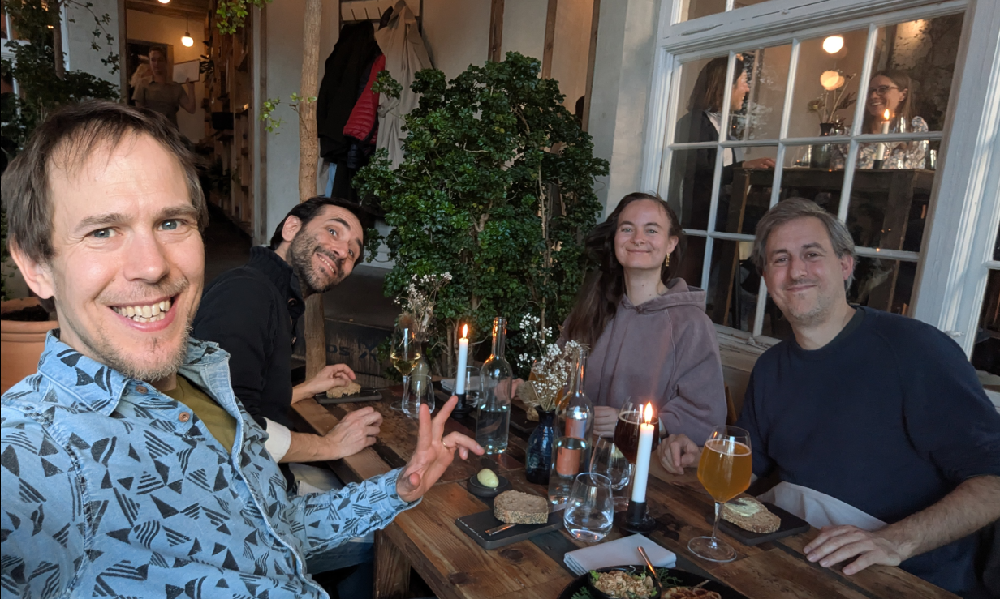

I spent the last three days in Copenhagen to examine a [thesis](https://en.itu.dk/Research/PhD-Programme/PhD-Defences/PhD-Defences-2025/March/Anastassia-Vybornova).
I assumed the capital of bike-friendly Denmark and inspiration for the '[Copenhaganize index](https://copenhagenizeindex.eu/)' (which Copenhagen of course leads, with a score of 90.2% as of 2019) would have a lot to offer a transport researcher, and it did not disappoint.
For some thoughts, links and photos from the trip, rea

In fact, transport research was the reason I went: to be part of the committee examining a PhD.
This was the second PhD defense (also known as a viva) that I've done, and the first outside the UK.[^1]

[^1]: I was a reviewer of a [thesis](https://bsky.app/profile/robinlovelace.bsky.social/post/3llxvrb652c2e) by Christian Werner on "Integrated geospatial network assessment for planning support in cycling mobility"

The "PhD defense" (also known as the viva) processes [vary](https://eprints.bournemouth.ac.uk/37508/7/624-Article%20Text-966-1-10-20230112.pdf) from country to country and even from university-to-university within the same country [@vanteijlingen2022].
In the UK, vivas take place in a "[non-public](https://vitae.ac.uk/resource/working-in-research/doctoral-research/the-viva/)" space, typically with two examiners, one internal (based in the same institution as the student) and the other external (a subject expert from a different institution).
In Denmark (and many other countries) the defense happens in public.
There are three examiners, one of whom "[must be from outside of Denmark, unless this is not practicable considering the subject in question](https://www.dtu.dk/english/-/media/dtudk/uddannelse/phd-udannelse/dokumenter/dtus-rules-for-the-phd-programme-may-2023.pdf)".

The thesis I examined was Anastassia Vybornova's, titled "Urban Data Science for Sustainable Mobility".

As the title suggests, it was a multi-disciplinary thesis, combining elements of data science (including reproducible research and open source software development), network science, transport/mobility, and urban planning.
4 out of the 8 papers focussed on cycle network design, a topic that is right up my street, and something that I could comment on.
This focus on cycling: research into active modes is "dwarfed" research into motorised modes, as the thesis rightly points out, and the papers in this thesis help address the imbalance.

I recommend anyone with an interest in the topic to take a read of the papers (see below).
A particular highlight for me was the strength of the introduction that tied all the papers together: each aspect of the thesis's title Urban Data Science for Sustainable Mobility was discussed and defined upfront, setting the scene for the papers.

I was particularly struck by the discussion of data science, something that I often take for granted.
Data science is defined in the thesis succinctly and correctly as "learning from data".
One thing that I learned from the thesis was that the term "data science" was popularised in a [article](https://hbr.org/2012/10/data-scientist-the-sexiest-job-of-the-21st-century) outlining how the term began to be used in a commercial context, for example "to optimize the service contracts and maintenance intervals for industrial products" according to one example from this highly-cited (and seemingly seminal) article [@davenport2012].

This early commercial focus (or even its reason for existing) may come as a surprise given how prominent the term is in academic and public-sector research: data science is now taught as an academic subject in many if not most universities, and several academic journals bear its name.
There are even job titles such as my job as Professor of Transport Data Science.
Contemporary usage emphasise computational and data-driven techniques while perhaps glossing-over the term's commercial origins.
That's not to imply that data science is bad, but the history of the term suggests that it could benefit from being reclaimed, as stated in this apt quote from the thesis:

> The challenge therefore lies in repurposing digital tools and methods, putting them into service of a sustainable mobility shift instead.

The contents of the thesis 'walk the walk' by tackling the challenge head-on, producing important methodological and empirical contributions — plus some valuable open source software packages and reproducible code that future work can build on — in the process.

The thesis is composed of the following papers:

1.  Paper 1: "A shape-based heuristic for the detection of urban block artifacts in street networks" [@fleischmann2024]
2.  Paper 2: "BikeDNA: A tool for bicycle infrastructure data and network assessment" \[@vierø2024
3.  Paper 3: "How Good Is Open Bicycle Network Data? A Countrywide Case Study of Denmark" \[@vierø2025
4.  Paper 4: "You Don’t Have to Live Next to Me: Towards a Demobilization of Individualistic Bias in Computational Approaches to Urban Segregation" [@vybornova2024]
5.  Paper 5: "Automated Detection of Missing Links in Bicycle Networks" \[@vybornova2022
6.  Paper 6: "BikeNodePlanner: a data-driven decision support tool for bicycle node network planning" [@vybornova]
7.  Paper 7: "superblockify: A Python Package for Automated Generation, Visualization, and Analysis of Potential Superblocks in Cities" \[@büth2024
8.  Paper 8: "Urban highways are barriers to social ties" [@aiello]

That is a *lot* of ground covered in a single PhD and testament to the collaborative teamwork in action in the [NERDS lab](https://nerds.itu.dk/).
After an excellent presentation providing an overview of the work, and ideas that held the papers listed above together into a cohesive whole, there was an in-depth discussion in which the others on the committee and I asked many questions and got detailed answers.
Happy to say: Anastassia passed with flying colours 🎉

{fig-alt="Meal in Copenhagen"}

# The city

The city of Copenhagen is beautiful, child-friendly and highly conducive to active travel, things that are enabled by comparatively low (but still harmful) levels of car ownership and driving in city.
There are [entire books](https://www.detail.de/de_en/kobehavn-englisch) on the topic that I cannot do justice to here, so I will just share some photos I took during the trip order.

# References