I spent the last three days in Copenhagen to examine a [thesis](https://en.itu.dk/Research/PhD-Programme/PhD-Defences/PhD-Defences-2025/March/Anastassia-Vybornova).
I assumed the capital of bike-friendly Denmark and inspiration for the ‘[Copenhaganize index](https://copenhagenizeindex.eu/)’ (which Copenhagen of course leads, with a score of 90.2% as of 2019) would have a lot to offer a transport researcher, and it did not disappoint.
For some thoughts, links and photos from the trip, read on!

The reason for the trip was to be part of the committee examining a PhD.
This was the second PhD defense (also known as a viva) that I’ve done, and the first outside the UK, so quite a big occasion for me.[^1]
It was also a big occasion for the NERDS group in which the research was based, as it was the first PhD that had been completed in the lab.

The “PhD defense” (also known as the viva) processes [vary](https://eprints.bournemouth.ac.uk/37508/7/624-Article%20Text-966-1-10-20230112.pdf) from country to country and even from university-to-university within the same country (Teijlingen et al. 2022).
In the UK, vivas take place in a “[non-public](https://vitae.ac.uk/resource/working-in-research/doctoral-research/the-viva/)” space, typically with two examiners, one internal (based in the same institution as the student) and the other external (a subject expert from a different institution).
In Denmark (and many other countries) the defense happens in public.
There are three examiners, one of whom “[must be from outside of Denmark, unless this is not practicable considering the subject in question](https://www.dtu.dk/english/-/media/dtudk/uddannelse/phd-udannelse/dokumenter/dtus-rules-for-the-phd-programme-may-2023.pdf)”.

The thesis I examined was Anastassia Vybornova’s, titled “Urban Data Science for Sustainable Mobility”.

As the title suggests, it was a multi-disciplinary thesis, combining elements of data science (including reproducible research and open source software development), network science, transport/mobility, and urban planning.
4 out of the 8 papers focussed on cycle network design, a topic that is right up my street, and something that I could comment on.
This focus on cycling: research into active modes is “dwarfed” research into motorised modes, as the thesis rightly points out, and the papers in this thesis help address the imbalance.

I recommend anyone with an interest in the topic to take a read of the papers (see below), you can also download the [full PhD Thesis from the website itu.dk](https://en.itu.dk/Research/PhD-Programme/PhD-Defences/PhD-Defences-2025/March/Anastassia-Vybornova).
A particular highlight for me was the strength of the introduction that tied all the papers together: each aspect of the thesis’s title Urban Data Science for Sustainable Mobility was discussed and defined upfront, setting the scene for the papers.

I was particularly struck by the discussion of data science, something that I often take for granted.
Data science is defined in the thesis succinctly and correctly as “learning from data”.
One thing that I learned from the thesis was that the term “data science” was popularised in a [article](https://hbr.org/2012/10/data-scientist-the-sexiest-job-of-the-21st-century) outlining how the term began to be used in a commercial context, for example “to optimize the service contracts and maintenance intervals for industrial products” according to one example from this highly-cited (and seemingly seminal) article (Davenport and Patil 2012).

This early commercial focus (or even its reason for existing) may come as a surprise given how prominent the term is in academic and public-sector research: data science is now taught as an academic subject in many if not most universities, and several academic journals bear its name.
There are even job titles such as my job as Professor of Transport Data Science.
Contemporary usage emphasise computational and data-driven techniques while perhaps glossing-over the term’s commercial origins.
That’s not to imply that data science is bad, but the history of the term suggests that it could benefit from being reclaimed, as stated in this apt quote from the [thesis](Trip%20to%20Copenhagen%20to%20examine%20a%20thesis%20on%20urban%20data%20science%20for%20sustainable%20mobility%20and%20to%20explore%20and%20develop%20bike%20and%20collaborative%20research%20networks):

> The challenge therefore lies in repurposing digital tools and methods, putting them into service of a sustainable mobility shift instead.

The contents of the thesis ‘walk the walk’ by tackling the challenge head-on, producing important methodological and empirical contributions — plus some valuable open source software packages and reproducible code that future work can build on — in the process.

The thesis is composed of the following papers:

1.  Paper 1: “A shape-based heuristic for the detection of urban block artifacts in street networks” (Fleischmann and Vybornova 2024)
2.  Paper 2: “BikeDNA: A tool for bicycle infrastructure data and network assessment” (Vierø, Vybornova, and Szell 2024)
3.  Paper 3: “How Good Is Open Bicycle Network Data? A Countrywide Case Study of Denmark” (Vierø, Vybornova, and Szell 2025)
4.  Paper 4: “You Don’t Have to Live Next to Me: Towards a Demobilization of Individualistic Bias in Computational Approaches to Urban Segregation” (A. Vybornova and Verma 2024)
5.  Paper 5: “Automated Detection of Missing Links in Bicycle Networks” (Anastassia Vybornova et al. 2022)
6.  Paper 6: “BikeNodePlanner: a data-driven decision support tool for bicycle node network planning” (Anastassia Vybornova et al., n.d.)
7.  Paper 7: “superblockify: A Python Package for Automated Generation, Visualization, and Analysis of Potential Superblocks in Cities” (Büth, Vybornova, and Szell 2024)
8.  Paper 8: “Urban highways are barriers to social ties” (Aiello et al., n.d.)

That is a *lot* of ground covered in a single PhD and testament to the collaborative teamwork in action in the [NERDS lab](https://nerds.itu.dk/).
After an excellent presentation providing an overview of the work, and ideas that held the papers listed above together into a cohesive whole, there was an in-depth discussion in which the others on the committee and I asked many questions and got detailed answers.
Happy to say: Anastassia passed with flying colours 🎉

<figure>

<figcaption aria-hidden="true">Meal with Anastassia, PhD supervisor Michael, and the 3/2rds of the examination committee to celebrate</figcaption>
</figure>

# The city

The city of Copenhagen is beautiful, child-friendly and highly conducive to active travel, things that are enabled by comparatively low (but still harmful) levels of car ownership and driving in city.
There are [entire books](https://www.detail.de/de_en/kobehavn-englisch) on the topic that I cannot do justice to here, so I will just share some photos I took during the trip.

<figure>
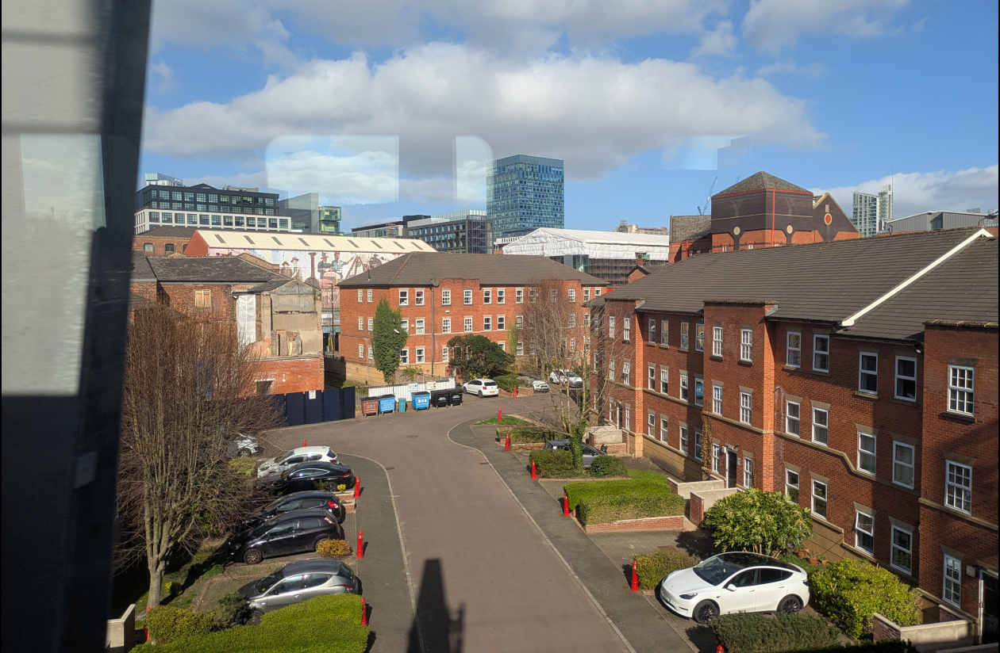
<figcaption aria-hidden="true">Photo of Manchester from the train to the airport on the way to Copenhage, highlighting the fact that there is great potential to ‘copenhagenize’ and make existing cities more liveable. Small interventions like providing clearly demarcated space for cycling and narrowing the carriageway that has low levels of traffic could help, as illustrated in the image below.</figcaption>
</figure>

<figure>
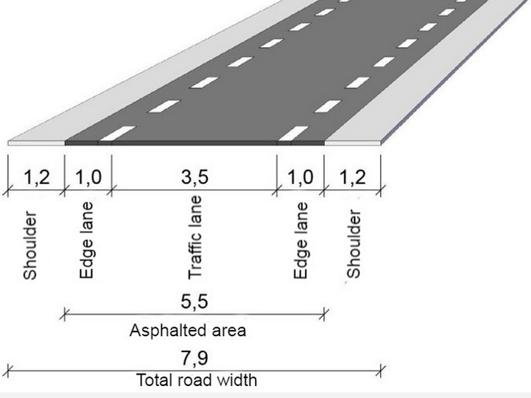
<figcaption aria-hidden="true">Illustration of “edge lane roads” implemented on a growing number of residential roads in Denmark, providing a cost-effective way of creating space for cycling while reducing vehicle speeds (note the lack of a centreline, encouraging safe driving). Source, the <a href="https://cyclingsolutions.info/edge-lane-roads/">Cycling Emassy of Denmark website, hosted at cylingsolutions.info</a>.</figcaption>
</figure>

<figure>
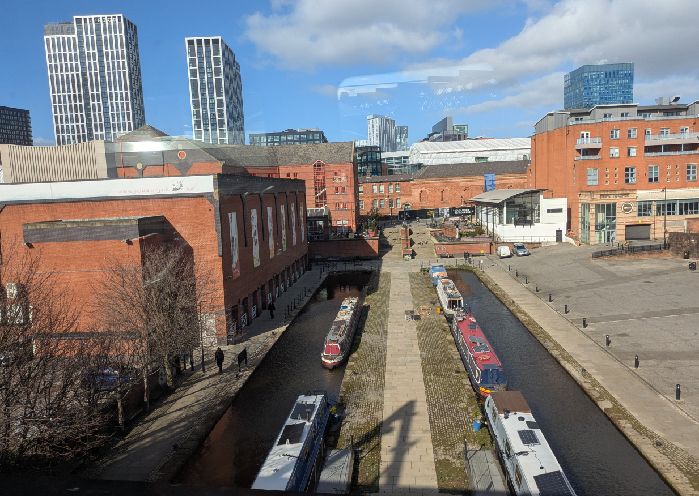
<figcaption aria-hidden="true">Another photo of central Manchester from the train on the way to the airport. This image shows that there are some very liveable and beautiful spaces in the UK, a major issue being the lack of safe active travel routes between them, something that is tackled in “paper 5” of Anastassia’s thesis, on identifying gaps in networks.</figcaption>
</figure>

<figure>
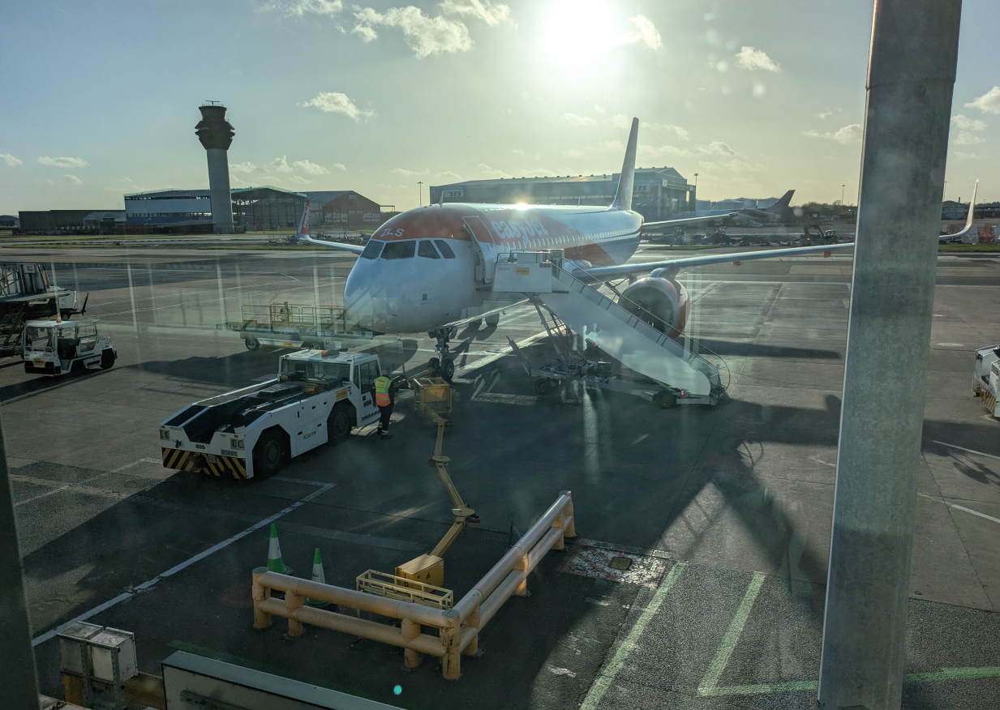
<figcaption aria-hidden="true">The plane that took me to Copenhagen. There is a tension between the benefits of international links which can grow with in-person meetings and the benefits of reducing travel demand, highlighted by the “<a href="https://noflyclimatesci.org/">No Fly Climate Sci</a>” movement and the article “<a href="https://www.theguardian.com/travel/2019/may/22/could-you-give-up-flying-meet-the-no-plane-pioneers">Could you give up flying? Meet the no-plane pioneers</a>”.</figcaption>
</figure>

<figure>
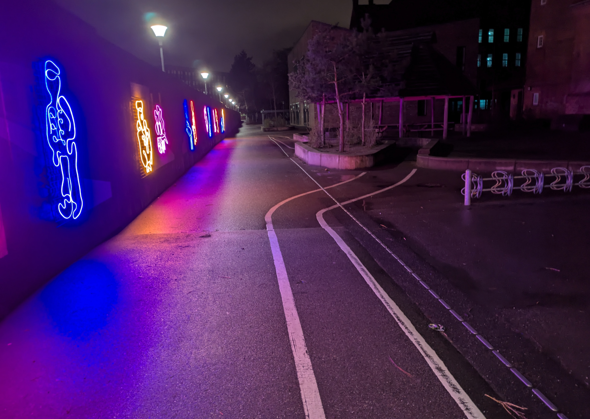
<figcaption aria-hidden="true">The first bit of cycle infrastructure I came across on the walk from the metro station to Zoku, the place I was staying. This infrastructure is not really good from a utilitarian perspective but it’s good from a fun perspective, highlighting the fact that infrastructure should be fun and child-friendly in places.</figcaption>
</figure>

<figure>
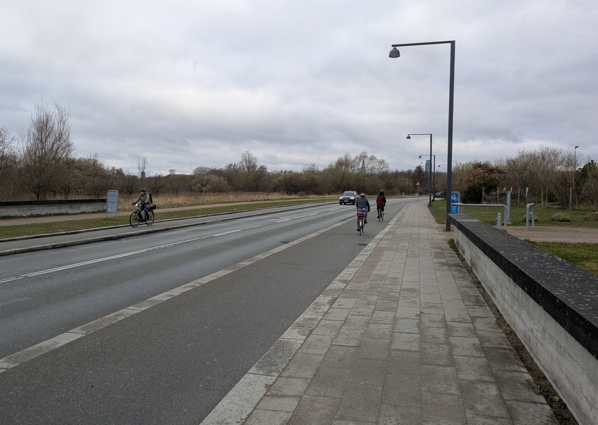
<figcaption aria-hidden="true">The first view I got of the rush hour, from a run on my first day in Copenhagen. Note: cycles outnumber cars by around 3:1. I suspect that that modal split is about right for many roads in central cophagen.</figcaption>
</figure>

<figure>
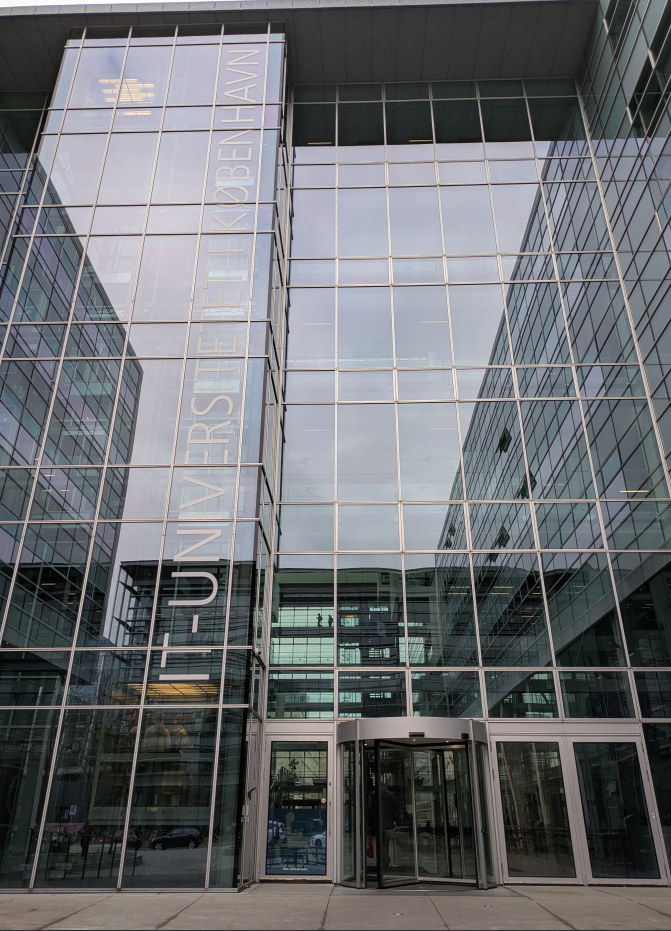
<figcaption aria-hidden="true">The main building of the <a href="https://itu.dk/">IT University of Copenhagen</a> where the research and defense took place.</figcaption>
</figure>

<figure>
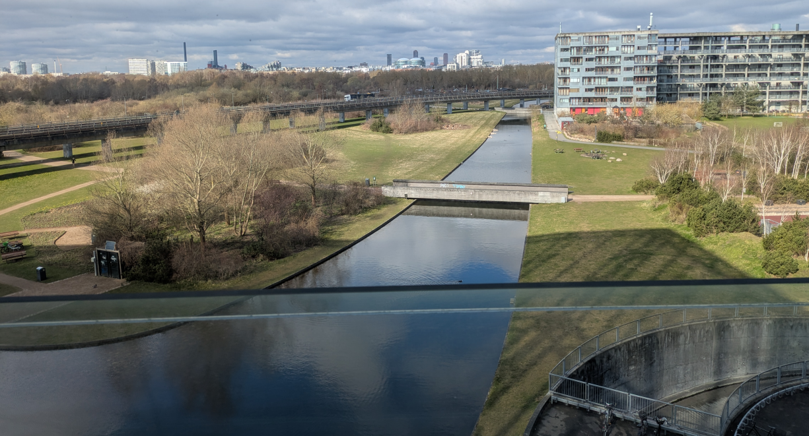
<figcaption aria-hidden="true">The view from an office in ITU.</figcaption>
</figure>

<figure>
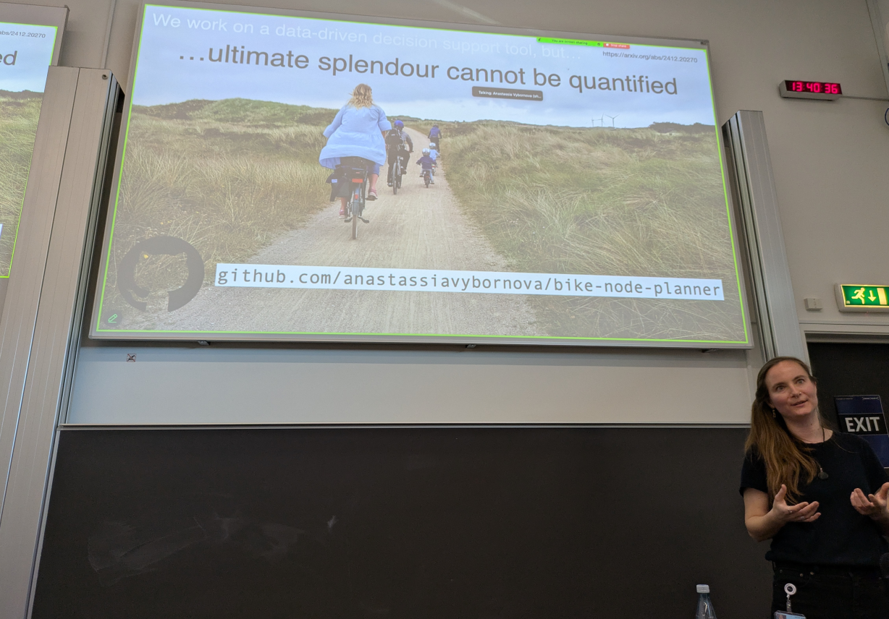
<figcaption aria-hidden="true">Anasstasia in action during the presentation of the thesis</figcaption>
</figure>

<figure>
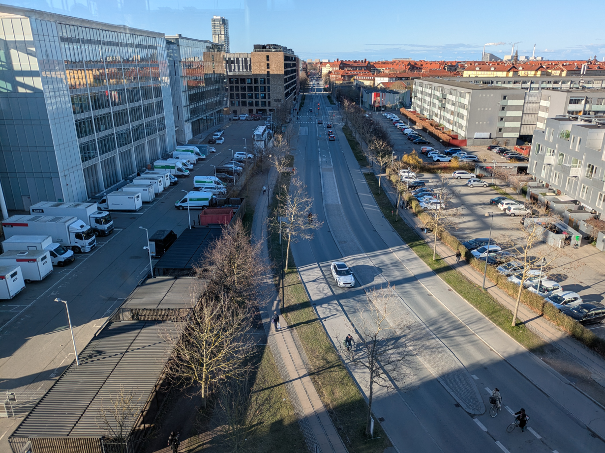
<figcaption aria-hidden="true">A typical arterial road in Denmark. Note: the amount of space taken by private motorised modes is greater than the amount of space dedicated for active travel. This suggests that there is room for improvement for active travel provision and quick wins even in cities with active travel levels that are high compared with most cities worldwide but which still have a high level of car ownership and use in absolute terms.</figcaption>
</figure>

<figure>
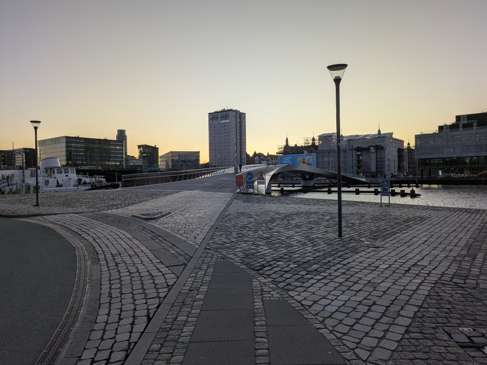
<figcaption aria-hidden="true">One of many bridges for active travel in Copenhagen. Note the width of the paths and space enabling high levels of cycle and foot traffic. It is a beautiful site to behold.</figcaption>
</figure>

<figure>
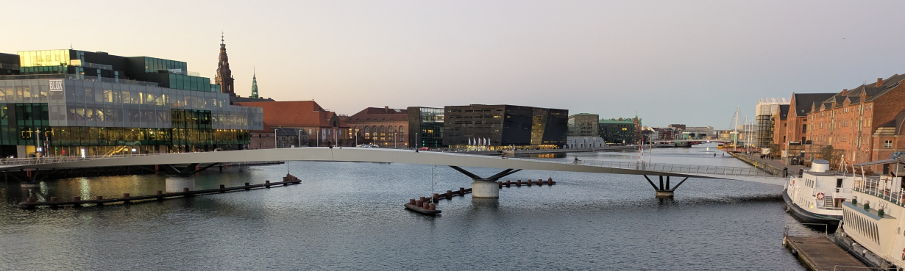
<figcaption aria-hidden="true">Another car-free bridge, highlighting the scale of active travel infrastructure and investment for a joined-up network.</figcaption>
</figure>

<figure>
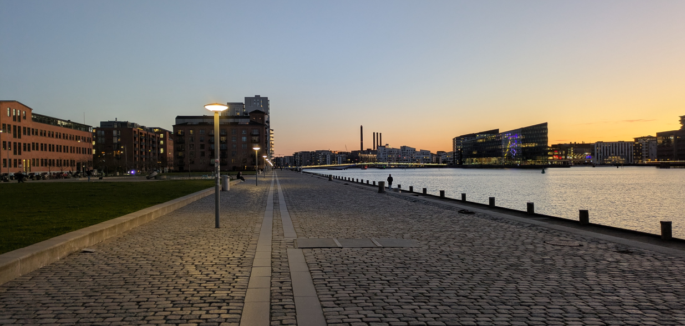
<figcaption aria-hidden="true">The Copehagen skyline</figcaption>
</figure>

<figure>
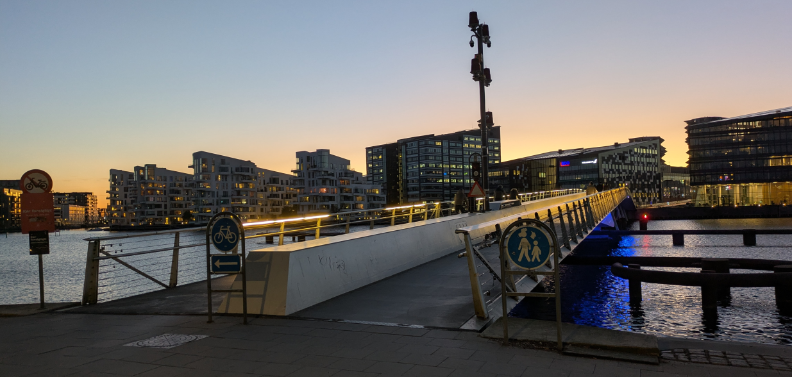
<figcaption aria-hidden="true">An example of clear separation between cycling and walking modes.</figcaption>
</figure>

<figure>
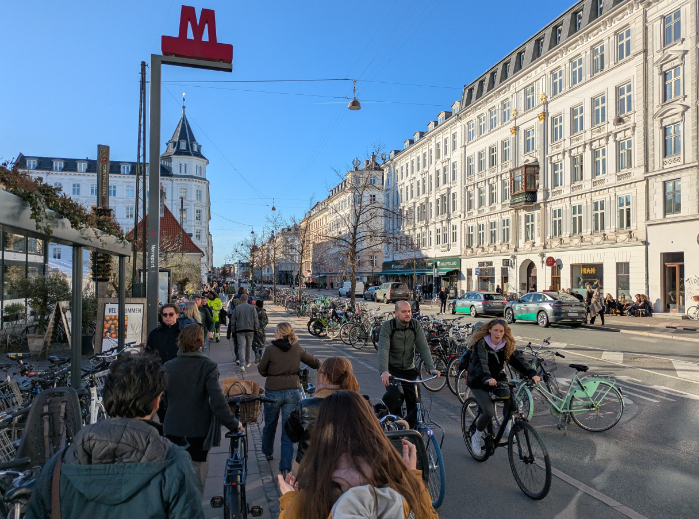
<figcaption aria-hidden="true">Central Copenhagen, highlighting the high throughflow of pedestrians and cyclists enabled by space allocation policies, and the fact that there are bike parking spaces *everywhere* in the city.</figcaption>
</figure>

Overall it was an inspiring trip.
There are many research ideas brewing, and I look forward to putting some of them into thought, words, code and action over the coming months.
I would love to learn more about how Copenhagen and other cities with high percentages of trips made by active modes got there so feel free to get in touch on that.
If you’re interested in any of the code underlying Anastassia’s thesis, check out the [NERDSITU GitHub organisation](https://github.com/NERDSITU/).

More could be said on the research and city sides, I would love to create a photo map of my trip, but that can wait for another day.

# References

Aiello, Luca Maria, Anastassia Vybornova, Sándor Juhász, Michael Szell, and Eszter Bokányi. n.d. “Urban Highways Are Barriers to Social Ties.” <https://doi.org/10.48550/arXiv.2404.11596>.

Büth, Carlson Moses, Anastassia Vybornova, and Michael Szell. 2024. “Superblockify: A Python Package for Automated Generation, Visualization, and Analysis of Potential Superblocks in Cities.” *Journal of Open Source Software* 9 (100): 6798. <https://doi.org/10.21105/joss.06798>.

Davenport, Thomas H., and D. J. Patil. 2012. “Data Scientist: The Sexiest Job of the 21st Century.” *Harvard Business Review*, October. <https://hbr.org/2012/10/data-scientist-the-sexiest-job-of-the-21st-century>.

Fleischmann, Martin, and Anastassia Vybornova. 2024. “A Shape-Based Heuristic for the Detection of Urban Block Artifacts in Street Networks.” *Journal of Spatial Information Science*, no. 28 (June): 75–102. <https://doi.org/10.5311/JOSIS.2024.28.31>.

Teijlingen, Edwin van, Bibha Simkhada, Pramod Regmi, Padam Simkhada, Vanora Hundley, and Krishna C. Poudel. 2022. “Reflections on Variations in PhD Viva Regulations: “And the Options Are …”.” *Journal of Education and Research* 12 (2): 61–74. <https://doi.org/10.51474/jer.v12i2.624>.

Vierø, Ane Rahbek, Anastassia Vybornova, and Michael Szell. 2024. “BikeDNA: A Tool for Bicycle Infrastructure Data and Network Assessment.” *Environment and Planning B: Urban Analytics and City Science* 51 (2): 512–28. <https://doi.org/10.1177/23998083231184471>.

———. 2025. “How Good Is Open Bicycle Network Data? A Countrywide Case Study of Denmark.” *Geographical Analysis* 57 (1): 52–87. <https://doi.org/10.1111/gean.12400>.

Vybornova, Anastassia, Tiago Cunha, Astrid Gühnemann, and Michael Szell. 2022. “Automated Detection of Missing Links in Bicycle Networks.” *Geographical Analysis* n/a (n/a). <https://doi.org/10.1111/gean.12324>.

Vybornova, Anastassia, Ane Rahbek Vierø, Kirsten Krogh Hansen, and Michael Szell. n.d. “BikeNodePlanner: A Data-Driven Decision Support Tool for Bicycle Node Network Planning.” <https://doi.org/10.48550/arXiv.2412.20270>.

Vybornova, A., and T. Verma. 2024. “You Don’t Have to Live Next to Me: Towards a Demobilization of Individualistic Bias in Computational Approaches to Urban Segregation.” Copenhagen.

[^1]: I was a reviewer of a [thesis](https://bsky.app/profile/robinlovelace.bsky.social/post/3llxvrb652c2e) by [Christian Werner](https://christianwerner.at/) on “Integrated geospatial network assessment for planning support in cycling mobility” but was not part of the defense committee.
    The first PhD thesis I examined was “Rethinking streets: a study of streetspace allocation metrics and street networks in London” by [Nicolas Palominos](https://npalomin.github.io/).
