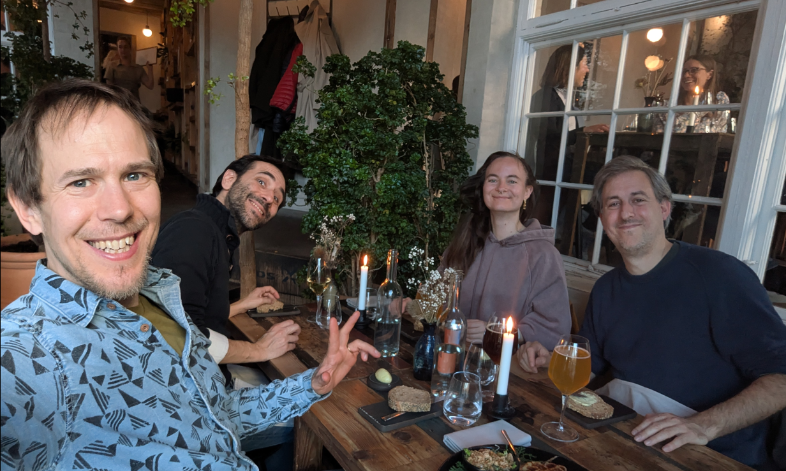

I spent the last three days in Copenhagen, the capital of bike-friendly Denmark and inspiration for the ‘[Copenhaganize index](https://copenhagenizeindex.eu/)’ (which Copenhagen leads, with a score of 90.2% as of 2019).
I assumed it would have a lot to offer a transport researcher, and it did not disappoint.

In fact, transport research was the reason I went: to be part of the committee examining a PhD.
This was the second PhD defense (also known as a viva) that I’ve done, and the first outside the UK.[^1]

# Introduction

The “PhD defense” (also known as the viva) processes [vary](https://eprints.bournemouth.ac.uk/37508/7/624-Article%20Text-966-1-10-20230112.pdf) from country to country and even from university-to-university within the same country (Teijlingen et al. 2022).
In the UK, vivas take place in a “[non-public](https://vitae.ac.uk/resource/working-in-research/doctoral-research/the-viva/)” space, typically with two examiners, one internal (based in the same institution as the student) and the other external (a subject expert from a different institution).
In Denmark (and many other countries) the defense happens in public.
There are three examiners, one of whom “[must be from outside of Denmark, unless this is not practicable considering the subject in question](https://www.dtu.dk/english/-/media/dtudk/uddannelse/phd-udannelse/dokumenter/dtus-rules-for-the-phd-programme-may-2023.pdf)”.

The PhD student I examined was Anastassia Vybornova and her thesis is titled “Urban Data Science for Sustainable Mobility”.

# The thesis and presentation

There is a need for more rigorous research into and modelling of active modes, which are “dwarfed” research into motorised modes, as the thesis rightly points out.

It was refreshing to see effort and critical thinking going into the topic are, with each aspect of the thesis’s title Urban Data Science for Sustainable Mobility discussed and defined upfront, setting the scene for the papers.

Data science is defined succinctly and correctly as “learning from data”.
One thing that I learned from the thesis was that the term “data science” was popularised in a [article](https://hbr.org/2012/10/data-scientist-the-sexiest-job-of-the-21st-century) outlining how the term began to be used in a commercial context.
Data science is described in general terms that align with the mainstream understanding of “doing computational things with data” but focusses on corporate uses, for example “to optimize the service contracts and maintenance intervals for industrial products” according to one example from this seminar article on the field.

This early commercial focus may come as a surprise given how prominent the term is in academic and public-sector research: data science is now taught as an academic subject in many if not most universities, and several academic journals bear its name.
There are even job titles such as my job as Professor of Transport Data Science.
Contemporary usage emphasise computational and data-driven techniques while perhaps glossing-over the term’s commercial origins.
That’s not to imply that data science is bad, but the history of the term suggests that it could benefit from being reclaimed, as stated in this apt quote from the thesis:

> The challenge therefore lies in repurposing digital tools and methods, putting them into service of a sustainable mobility shift instead.

The thesis is composed of the following papers:

1.  Paper 1: “A shape-based heuristic for the detection of urban block artifacts in street networks” (Fleischmann and Vybornova 2024)
2.  Paper 2: “BikeDNA: A tool for bicycle infrastructure data and network assessment” (**vierø2024?**)
3.  Paper 3: “How Good Is Open Bicycle Network Data? A Countrywide Case Study of Denmark” (**vierø2025?**)
4.  Paper 4: “You Don’t Have to Live Next to Me: Towards a Demobilization of Individualistic Bias in Computational Approaches to Urban Segregation” (**vybornova2024?**)
5.  Paper 5: “Automated Detection of Missing Links in Bicycle Networks” (**vybornova2023?**)
6.  Paper 6: “BikeNodePlanner: a data-driven decision support tool for bicycle node network planning” (**vybornova2024a?**)
7.  Paper 7: “superblockify: A Python Package for Automated Generation, Visualization, and Analysis of Potential Superblocks in Cities” (**büth2024?**)
8.  Paper 8: “Urban highways are barriers to social ties” (**aiello2024?**)

That is a *lot* of ground covered in a single PhD and testament to the collaborative teamwork in action in the NERDS lab.
4 out of the 8 papers focussed on cycle network design a topic that is right up my street, and something that I could comment on.
After an excellent presentation providing an overview of the work, and ideas that held the papers listed above together into a cohesive whole, there was an in-depth discussion in which the others on the committee and I asked many questions and got detailed answers.
Happy to say: Anastassia passed with flying colours 🎉

# The city

# References

Fleischmann, Martin, and Anastassia Vybornova. 2024. “A Shape-Based Heuristic for the Detection of Urban Block Artifacts in Street Networks.” *Journal of Spatial Information Science*, no. 28 (June): 75–102. <https://doi.org/10.5311/JOSIS.2024.28.31>.

Teijlingen, Edwin van, Bibha Simkhada, Pramod Regmi, Padam Simkhada, Vanora Hundley, and Krishna C. Poudel. 2022. “Reflections on Variations in PhD Viva Regulations: “And the Options Are …”.” *Journal of Education and Research* 12 (2): 61–74. <https://doi.org/10.51474/jer.v12i2.624>.

[^1]: I was a reviewer of a thesis by Christian Werner on “Integrated geospatial network assessment for planning support in cycling mobility”

    <blockquote class="bluesky-embed" data-bluesky-uri="at://did:plc:scyxpltepxvut6akgwojidty/app.bsky.feed.post/3llxvrb652c2e" data-bluesky-cid="bafyreifaqjq5s2tcta26aaotobnhxbjyfgfq4yw3swwrtd5tlkh7wi2zjm" data-bluesky-embed-color-mode="system">
    

    Belated congratulations to Christian Werner!
    I was a small part of the process as an external review and fully agree: excellent piece of work that contributes to the field and provides a strong foundation for other researchers with open and reproducible code and new ideas for network planning 🚲  <a href="https://bsky.app/profile/did:plc:scyxpltepxvut6akgwojidty/post/3llxvrb652c2e?ref_src=embed">\[image or embed\]</a>

    

    — Robin Lovelace (<a href="https://bsky.app/profile/did:plc:scyxpltepxvut6akgwojidty?ref_src=embed">(**robinlovelace.bsky.social?**)</a>) <a href="https://bsky.app/profile/did:plc:scyxpltepxvut6akgwojidty/post/3llxvrb652c2e?ref_src=embed">April 4, 2025 at 8:35 AM</a>

    </blockquote>
    
