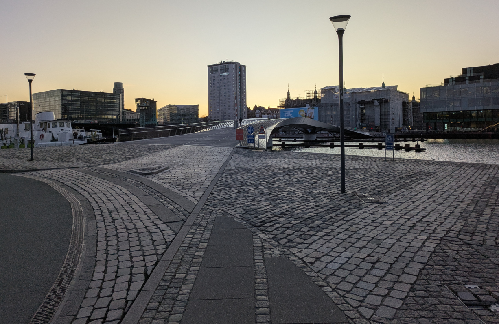

I spent the last three days in Copenhagen, the capital of bike-friendly Denmark and inspiration for the ‘[Copenhaganize index](https://copenhagenizeindex.eu/)’ (which Copenhagen leads, with a score of 90.2% as of 2019).
I assumed it would have a lot to offer a transport researcher, and it did not disappoint.

In fact, transport research *was* the reason I went.
Specifically, I went to examine a PhD, the second that I have had the privileged of passing judgment on, and the first PhD I had examined outside the UK.

The “PhD defense” (also known as the viva) processes [vary](https://eprints.bournemouth.ac.uk/37508/7/624-Article%20Text-966-1-10-20230112.pdf) from country to country and even from university-to-university within the same country (Teijlingen et al. 2022).
In the UK, vivas take place in a “non-public” space.
In Denmark (and many other countries) and includes the requirement that at least one of the roles must be based outside of Denmark.
I was honored to be invited, and didn’t fully realise what I was getting myself into (in a good way) until I was there.
- The PhD student I examined was Anastassia Vybornova and her thesis is titled “Urban Data Science for Sustainable Mobility”.

The focus is on datasets, tools and methods for sustainable transport in general and cycling networks in particular in 4 of the 8 papers, a focus that aligns with my research.
There is a need for more rigorous research into and modelling of active modes, which are “dwarfed” research into motorised modes, as the thesis rightly points out.
Data science is defined succinctly as “learning from data”.
One thing that I learned from the thesis was that the term “data science” was initially popularised by people using it for commercial gain.
— specifically …
This is surprising given how prominent the term is in academic research: data science is now taught as an academic subject in many if not most universities, several academic journals bear its name.
There are even job titles such as my job title — “Professor of Transport Data Science” — that make use of term’s emphasis on computational and data-driven techniques while perhaps glossing-over its commercial origins.
That’s not to imply that data science is bad, but the history of the term suggests that it could benefit from being reclaimed, as stated in this apt quote from the thesis:

> The challenge therefore lies in repurposing digital tools and methods, putting them into service of a sustainable mobility shift instead.

The thesis is composed of the following papers:

1.  Paper 1: “A shape-based heuristic for the detection of urban block artifacts in street networks” (**fleischmann2024?**)
2.  Paper 2: “BikeDNA: A tool for bicycle infrastructure data and network assessment” (**vierø2024?**)
3.  Paper 3: “How Good Is Open Bicycle Network Data? A Countrywide Case Study of Denmark” (**vierø2025?**)
4.  Paper 4: “You Don’t Have to Live Next to Me: Towards a Demobilization of Individualistic Bias in Computational Approaches to Urban Segregation” (**vybornova2024?**)
5.  Paper 5: “Automated Detection of Missing Links in Bicycle Networks” (**vybornova2023?**)
6.  Paper 6: “BikeNodePlanner: a data-driven decision support tool for bicycle node network planning” (**vybornova2024a?**)
7.  Paper 7: “superblockify: A Python Package for Automated Generation, Visualization, and Analysis of Potential Superblocks in Cities” (**büth2024?**)
8.  Paper 8: “Urban highways are barriers to social ties” (**aiello2024?**)

That is a *lot* of ground covered in a single PhD and testament to the collaborative teamwork in action in the NERDS lab.

Teijlingen, Edwin van, Bibha Simkhada, Pramod Regmi, Padam Simkhada, Vanora Hundley, and Krishna C. Poudel. 2022. “Reflections on Variations in PhD Viva Regulations: “And the Options Are …”.” *Journal of Education and Research* 12 (2): 61–74. <https://doi.org/10.51474/jer.v12i2.624>.

