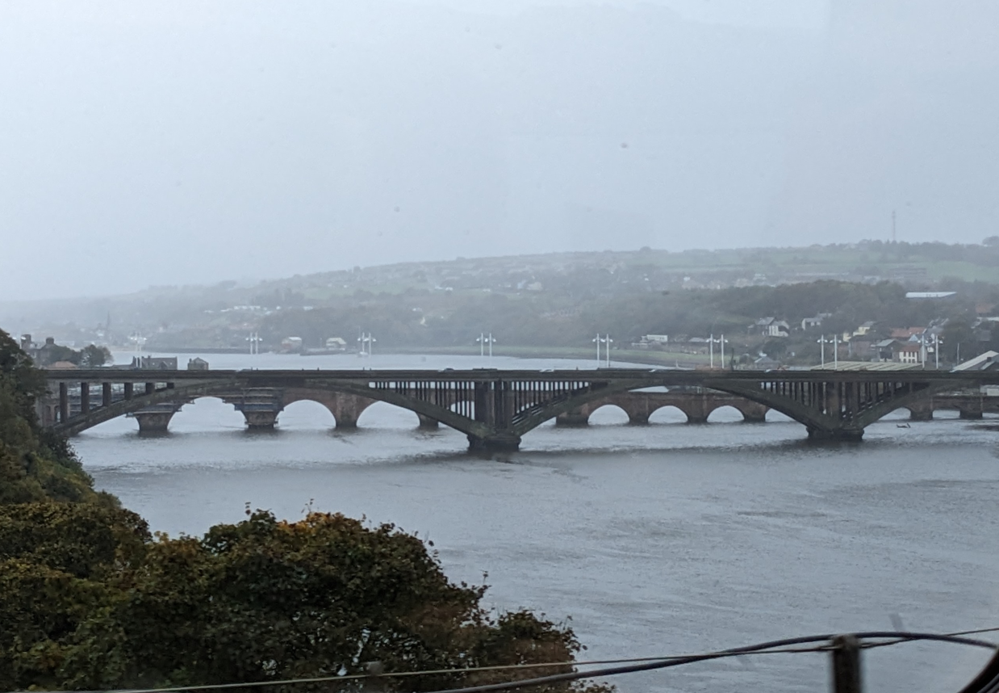

<blockquote class="twitter-tweet">
In a hybrid UBDC webinar at 3pm on Thursday 10 October, <a href="https://twitter.com/robinlovelace?ref_src=twsrc%5Etfw">@robinlovelace</a> from the Leeds Institute for Transport Studies will make the case that <a href="https://twitter.com/hashtag/ReproducibleResearch?src=hash&amp;ref_src=twsrc%5Etfw">#ReproducibleResearch</a> and <a href="https://twitter.com/hashtag/OpenTools?src=hash&amp;ref_src=twsrc%5Etfw">#OpenTools</a> are essential for effective 21st century <a href="https://twitter.com/hashtag/TransportPlanning?src=hash&amp;ref_src=twsrc%5Etfw">#TransportPlanning</a>. Full details: <a href="https://t.co/6E6kOfziXl">https://t.co/6E6kOfziXl</a>
&mdash; UBDC (@UrbanBigData) <a href="https://twitter.com/UrbanBigData/status/1843564536567107629?ref_src=twsrc%5Etfw">October 8, 2024</a></blockquote>  

## Blurb

[Robin Lovelace](https://www.robinlovelace.net) is Professor of Transport Data Science at the Leeds Institute for Transport Studies ([ITS](https://environment.leeds.ac.uk/transport/staff/953/dr-robin-lovelace)) and Head of Data Science at the UK government agency [Active Travel England](https://activetravelengland.gov.uk/).
Robin specializes in data science and geocomputation, with a focus on developing geographic methods applied to modeling transport systems, active travel, and decarbonisation.
Robin has experience not only researching but deploying transport models in inform sustainable policies and more effective use of transport investment, including as Lead Developer of the Propensity to Cycle Tool (see www.pct.bike), the basis of strategic cycle network plans nationwide.
Robin has led numerous data science projects for organizations ranging from the Department for Transport and Transport Infrastructure Ireland to the World Bank.

## Pre-event write up

I'm on my way up North, looking forward to it!

See below for info on the talk and how to attend/get involved.

Photo from the way up North:

See [eventbrite](eventbrite.html) for more details.