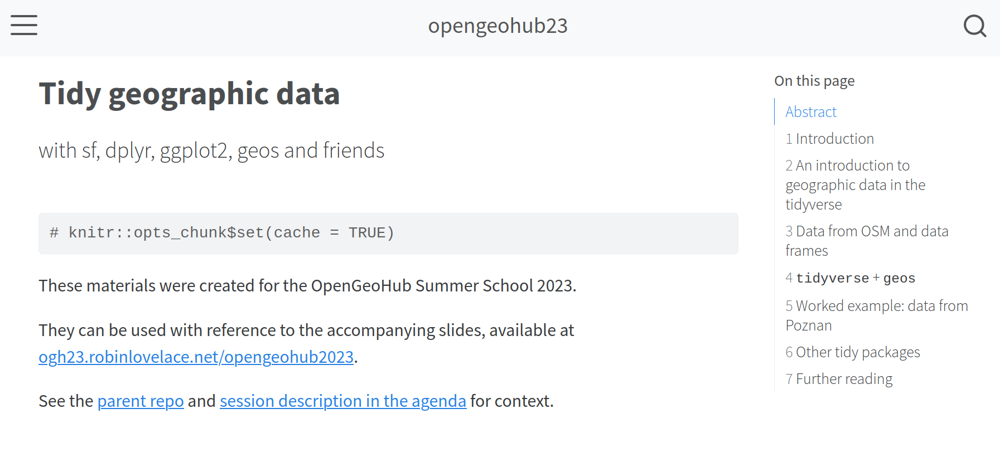
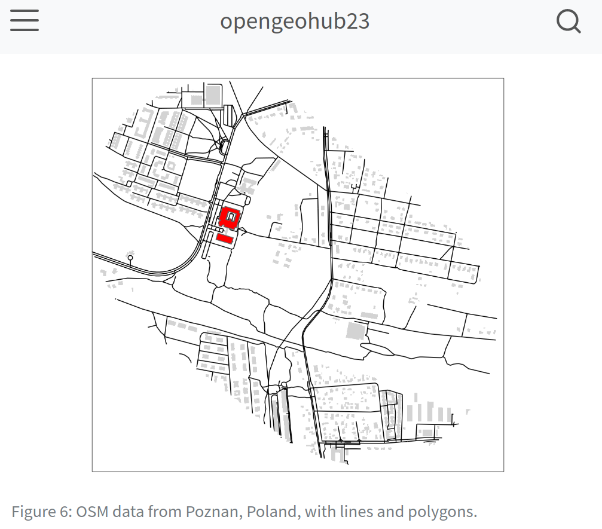

---

title: "Tidy geographic data with sf, dplyr, ggplot2, geos and friends"
event: OpenGeoHub Summer School
event-url: https://opengeohub.org/summer-school/opengeohub-summer-school-poznan-2023/
location: Adam Mickiewicz University
address:
  street: 
  city: Poznan
  region:
  postcode: 
  country: Poland
summary:
abstract: ""

date: 2023-08-27T17:00:00+02:00
date-end: 2023-09-01T17:00:00+02:00
all_day: false

publish-date: 2022-05-21T07:43:56+01:00

tags: []

featured: true

image: featured.png

url_slides: https://ogh23.robinlovelace.net/tidy-slides.html
url_code: https://github.com/Robinlovelace/opengeohub2023
url_pdf:
url_video:

slides: ""

projects: []
authors: ["Robin Lovelace"]
---
This workshop explores recent development in R's spatial data analysis ecosystem and exciting new developments in the field.

I deliver a 2 part session on 'Tidy Geographic Data', and a session on handling large OpenStreetMap datasets with R, `osmium` and other open source command-line tools.

As shown in the course [schedule](https://pretalx.earthmonitor.org/opengeohub-summer-school-2023/schedule/) I will deliver the following sessions:

-   [Tidy geographic data with sf, dplyr, ggplot2, geos and friends](https://pretalx.earthmonitor.org/opengeohub-summer-school-2023/talk/7JN3FV/)
    -   2023-08-28, 11:00--12:30, Room 21 (Sala 21)\
-   [Processing large OpenStreetMap datasets for geocomputation](https://pretalx.earthmonitor.org/opengeohub-summer-school-2023/talk/SRMZVJ)
    -   2023-09-01, 09:00--10:30, Room 18 (Sala 18)

