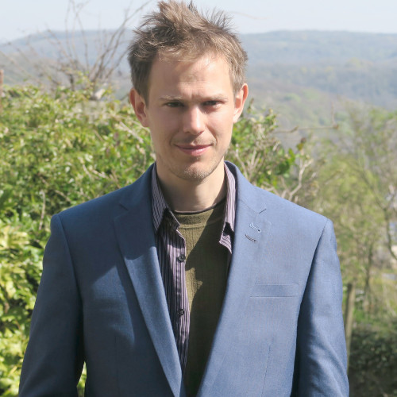

:::{.landing-shell}

:::{.landing-profile .landing-panel}
{.landing-avatar}

## Robin Lovelace {.landing-name}

  <a class="btn btn-outline-secondary btn-sm" href="mailto:r.lovelace@leeds.ac.uk">Email</a>
  <a class="btn btn-outline-secondary btn-sm" href="https://twitter.com/robinlovelace" target="_blank" rel="noopener">Twitter</a>
  <a class="btn btn-outline-secondary btn-sm" href="https://github.com/robinlovelace" target="_blank" rel="noopener">GitHub</a>
  <a class="btn btn-outline-secondary btn-sm" href="https://www.youtube.com/c/RobinLovelace" target="_blank" rel="noopener">YouTube</a>
  <a class="btn btn-outline-secondary btn-sm" href="https://fosstodon.org/web/@robinlovelace" target="_blank" rel="noopener">Mastodon</a>
  <a class="btn btn-outline-secondary btn-sm" href="https://scholar.google.co.uk/citations?user=xDJHVCAAAAAJ&hl=en" target="_blank" rel="noopener">Google Scholar</a>

:::

:::{.landing-main .landing-panel}
I am a [Professor of Transport Data Science](https://environment.leeds.ac.uk/transport/staff/953/dr-robin-lovelace) at the [University of Leeds](https://www.leeds.ac.uk/) [Institute for Transport Studies](https://environment.leeds.ac.uk/transport), where I build open tools and reproducible workflows for evidence-based transport planning.

I share code, methods, and writing on [GitHub](https://github.com/robinlovelace) and in the [posts section](/posts/). If you would like to collaborate, feel free to [email me](mailto:r.lovelace@leeds.ac.uk).

[Current projects](/projects/){.btn .btn-primary .me-2} [Publications](/publications/){.btn .btn-outline-secondary}

:::

:::{.landing-updates .landing-panel}
### Upcoming and Recent Talks and Events

:::{#upcoming-events}
:::

:::
:::
